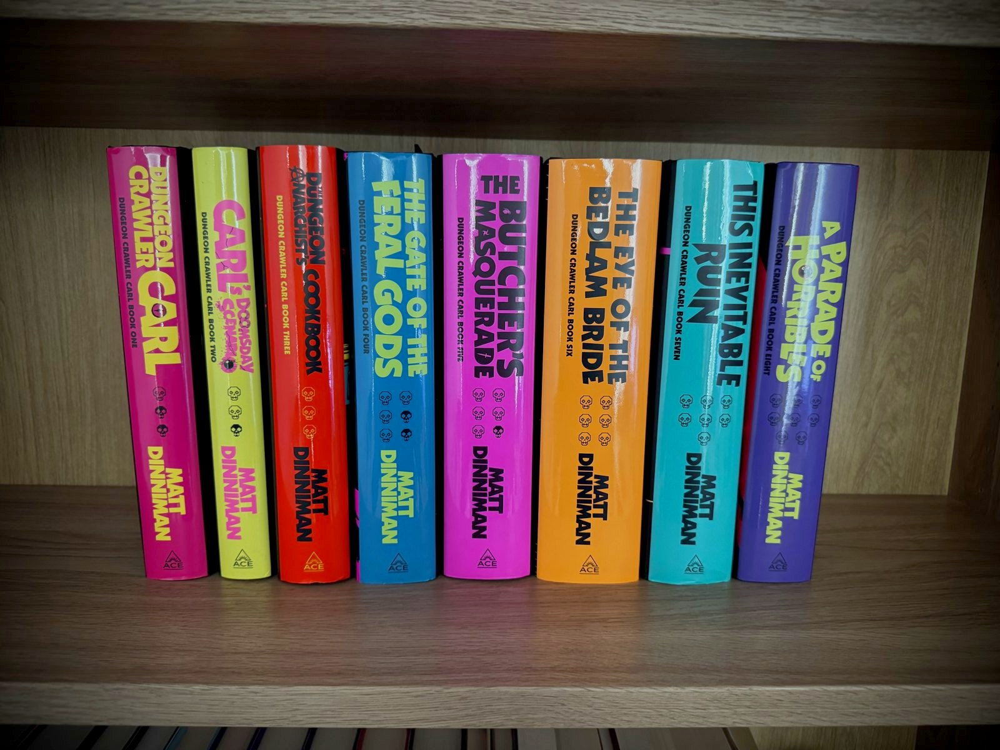
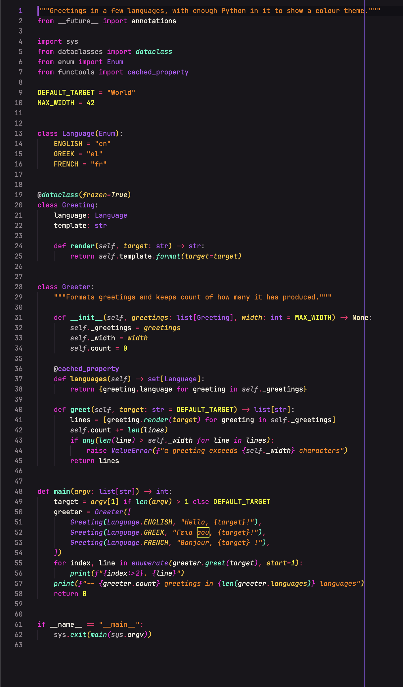
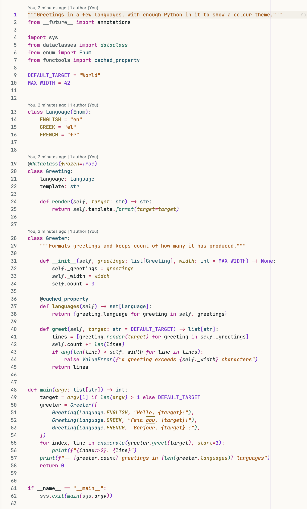

# Crawler Neon

Neon on black: a VS Code dark theme that takes one colour from each Dungeon Crawler Carl book jacket, with a light sibling.

The extension installs two themes: **Crawler Neon**, the dark theme most of
this page is about, and **Crawler Deluxe**, a light theme on cream and
parchment that keeps the same eight hues, darkened for daylight. The repo also carries a
matching shell prompt, as an [oh-my-posh](https://ohmyposh.dev) theme for zsh, bash and PowerShell
and as a plain zsh file that needs nothing installed, plus an Apple Terminal profile, a Vim colour
scheme and an eza theme, see [Beyond VS Code](#beyond-vs-code) below.

## Why this exists

I love these books, and I love how the Ace hardcovers look lined up on a shelf: each one a single
neon colour on black. At some point that started to look like a colour scheme, so I made it one.
One hue per book, on a ground as close to the jackets' black as an editor can comfortably get.



*The shelf in question.*

That is the whole connection. *Dungeon Crawler Carl* belongs to Matt Dinniman; the book jackets that lent
their colours were designed by Will Staehle for Ace. I have no rights to any of it and no affiliation
with any of them. Nothing from the covers is copied here, only eight colour values and the titles that
say where each one came from.

**If this theme sends someone to the books, that is the best thing it could do.**

**And remember, Crawlers: code, code, code.**

## Screenshots

### Crawler Neon



### Crawler Deluxe



Screenshots for TypeScript, C++, Rust and Shell in both themes are in
[`docs/samples`](docs/samples), next to the programs they show.

## Palette

- `#FAC234` book 1, *Dungeon Crawler Carl* — properties
- `#FB03D6` book 2, *Carl's Doomsday Scenario* — keywords
- `#FA2120` book 3, *The Dungeon Anarchist's Cookbook* — errors
- `#F3FB04` book 4, *The Gate of the Feral Gods* — numbers, constants, warnings
- `#02FB03` book 5, *The Butcher's Masquerade* — tags, success
- `#FC7E03` book 6, *The Eye of the Bedlam Bride* — strings
- `#03FBC7` book 7, *This Inevitable Ruin* — functions, info
- `#B455F0` book 8, *A Parade of Horribles* — types and the UI accent (lifted from the cover's `#9604DF`)

## Crawler Deluxe

The light sibling. The deluxe edition jacket lends its cream, parchment and deep-teal ink to the surfaces; the code
keeps the eight book hues, each darkened until it clears WCAG AA on cream. Pick it as your light theme and Crawler
Neon as the dark one and `window.autoDetectColorScheme` will switch between them.

## Modern UI

VS Code's experimental Modern UI (`workbench.experimental.modernUI`, sometimes switched on by experiment) ignores a
theme's classic tab colours and reads a separate set. Both themes define both sets, so the tinted active tab, panel
tabs and activity bar look the same either way. The chrome CSS below steps aside when Modern UI is on.

## Beyond VS Code

### Apple Terminal

`terminal/Crawler Neon.terminal` is a Terminal.app profile with the theme's background, text, cursor, selection and
all sixteen ANSI colours. Double-click it, or use *Shell → Import…* in Terminal, then make it the default in
*Settings → Profiles*. The prompt below matches it.

### Vim and Neovim

`vim/colors/crawler-neon.vim` covers syntax, UI, diff, Neovim diagnostics, tree-sitter groups and the built-in
terminal. Truecolor with `set termguicolors`, nearest xterm-256 colours otherwise. Copy it into `~/.vim/colors/`
or `~/.config/nvim/colors/`, or point a plugin manager at this repo with `vim` as the runtime path, then
`colorscheme crawler-neon`.

### eza

`eza/theme.yml` colours [eza](https://github.com/eza-community/eza) listings to match: directories purple,
executables green, symlinks aqua, sizes from gold through orange to red, git states in the editor's green,
yellow, red and aqua. Copy or symlink it to `~/.config/eza/theme.yml`, or point `EZA_CONFIG_DIR` at the
`eza` folder. Two things catch people out: on macOS eza looks in `~/Library/Application Support/eza`
unless `EZA_CONFIG_DIR` is set, and a `LS_COLORS` variable, such as the one oh-my-zsh exports, overrides the
theme's directory colour, so `unset LS_COLORS` after your framework loads. There is no `EZA_THEME` variable.

## Shell prompt

Two flavours of the same prompt: folder in gold, git branch in magenta with change markers, Python environment
in aqua, the last command's duration, and a purple prompt character that turns red after a failing command.

### Plain zsh

`shell/crawler-neon.zsh` needs nothing installed, no framework and no special font. Add to `.zshrc`:

```zsh
source "$HOME/path/to/crawler-neon-theme/shell/crawler-neon.zsh"
```

Terminals without truecolor, Apple Terminal among them, get the nearest of the 256 standard colours automatically.

### oh-my-posh

`shell/crawler-neon.omp.json` is an [oh-my-posh](https://ohmyposh.dev) theme with the same layout in bubbles,
for anyone already running oh-my-posh. Needs a Nerd Font.

zsh, in `.zshrc`:

```zsh
eval "$(oh-my-posh init zsh --config "$HOME/path/to/crawler-neon-theme/shell/crawler-neon.omp.json")"
```

bash, in `.bashrc`:

```bash
eval "$(oh-my-posh init bash --config "$HOME/path/to/crawler-neon-theme/shell/crawler-neon.omp.json")"
```

PowerShell, in `$PROFILE`:

```powershell
oh-my-posh init pwsh --config "$HOME\path\to\crawler-neon-theme\shell\crawler-neon.omp.json" | Invoke-Expression
```

## Speckle and chrome

Two optional CSS files for the [Custom CSS and JS](https://marketplace.visualstudio.com/items?itemName=be5invis.vscode-custom-css)
extension, both scoped to these themes. `speckle/crawler-neon-speckle.css` adds the jackets' grain to Crawler Neon's
editor ground; `chrome/crawler-neon-chrome.css` rounds tabs, panes, the command palette and widgets and sets Inter as
the UI font when it is installed. Add the two files from a checkout of this repo to `vscode_custom_css.imports`, then
run *Reload Custom CSS and JS* and restart. The entries are `file://` URLs:

```jsonc
"vscode_custom_css.imports": [
  "file:///Users/you/crawler-neon-theme/chrome/crawler-neon-chrome.css",   // macOS
  "file:///home/you/crawler-neon-theme/chrome/crawler-neon-chrome.css",    // Linux
  "file:///C:/Users/you/crawler-neon-theme/chrome/crawler-neon-chrome.css"  // Windows
]
```

The ground is a very dark grey with a faint maroon cast, a step up from the jackets' black.
Every syntax colour clears WCAG AA on it.

## Install

Download the prebuilt `.vsix` from the [latest release](https://github.com/NLykoskoufis/crawler-neon-theme/releases/latest), then either:

- VS Code → Extensions panel → `⋯` menu → **Install from VSIX…**, or
- `code --install-extension <downloaded-file>.vsix`

### From source

Requires Node.js. From the repo root:

```bash
npx @vscode/vsce package --allow-missing-repository --skip-license --out crawler-neon-theme.vsix
code --install-extension crawler-neon-theme.vsix
```

The same two commands work in PowerShell and cmd on Windows. On Linux the CLI may
be `codium` or `code-insiders`, depending on the build you installed.

Reload the window, then pick **Crawler Neon** via `Cmd+K Cmd+T` on macOS or
`Ctrl+K Ctrl+T` on Windows and Linux, or through *Preferences: Color Theme*
in the command palette.

Copying the folder into `~/.vscode/extensions/` (`%USERPROFILE%\.vscode\extensions`
on Windows) does not work — VS Code only loads extensions listed in
`extensions.json`, which the installer writes.

## Licence

MIT — see [`LICENSE`](LICENSE).
